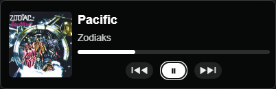
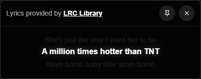

# Simple Media Overlay

## About this project

I wanted to build a simple media overlay app that stays on top, so I vibe-coded one. This app uses [tauri](https://v2.tauri.app/) in the backend (using [win-gsmtc](https://docs.rs/win-gsmtc/latest/gsmtc/) to get media info from Windows) and [NextJS](https://nextjs.org/) as the frontend, and honestly, it turned out better than I thought:



I decided to add a second overlay that displays synced lyrics, if available, since I found [LRC Library](https://lrclib.net) and [their repo on GitHub](https://github.com/tranxuanthang/lrclib) - here's how that overlay looks:



## Features

- 📻 Always-on-top overlay that displays currently playing media
- ℹ️ Auto-scrolling for longer titles & artist names
- 📍 Pin the overlay to avoid accidentally moving it, unpin to allow dragging again
- 👀 Little icon in the bottom left corner of the album art, showing the source of the currently playing media
- ⏯️ Play/Pause, Skip to next or previous track or use the seek bar to skip to a certain part of the currently playing media
- 🔁 Toggle repeat mode and/or shuffle, [if supported by the player](#current-limitations)
- 🎼 Toggle the _Lyrics Overlay_ to see synced lyrics, if available on [LRC Library](https://lrclib.net)
- ✨ Fancy animations when the currently played media or the playback source changes, is played/paused or the overlay is pinned

## Prerequisites

- **Windows 10 or Windows 11** - This app currently only works on Windows (see [Current Limitations](#current-limitations))

### Additional requirements for developers

If you want to build from source or contribute to development:

- **[Node.js](https://nodejs.org/)** (v18 or higher recommended)
- **[Rust](https://www.rust-lang.org/tools/install)** and [Tauri prerequisites](https://v2.tauri.app/start/prerequisites/)

## Running the overlay

### For end users

Simply download either the NSIS or MSI installer from the [latest release](https://github.com/fl0-at/simple-media-overlay/releases/latest).

The app includes automatic update notifications - you'll be notified when a new version is available!

### For developers

1. **Install dependencies:**

   ```bash
   npm install
   ```

2. **Run in development mode:**

   ```bash
   npx tauri dev
   ```

3. **Build from source:**

   ```bash
   npx tauri build
   ```

Make sure you have [Rust](https://www.rust-lang.org/tools/install) and the [Tauri prerequisites](https://v2.tauri.app/start/prerequisites/) installed before building.

## Supported media playback sources

Any media player or application that publishes metadata about the currently playing media via GSMTC APIs should work out of the box, but these ones were tested and have their own dedicated icons:

- 🌐 Google Chrome
- 🌎 Microsoft Edge
- 🦊 Mozilla Firefox
- 🦁 Brave Browser
- ⭕ Opera Browser
- 🎻 Vivaldi Browser
- 🌊 Tidal Desktop Client
- 🛜 Spotify Desktop Client
- 🚧 Videolan VLC (UWP App only as of now)
- 👽 Foobar2000
- 🐒 MediaMonkey 2024
- 🪟 Windows 11 default media player

For the following apps, I have not tested, but they should have their own icons:

- 🍎 Apple Music
- 🎧 Apple Podcasts
- 🎵 iTunes
- 🧭 Safari Browser
- ▶️ Groove Media Player
- ⚡ Winamp

_I also added Kodi, KMPlayer, and Media Player Classic (MPC-HC [as maintained by clsid2](https://github.com/clsid2/mpc-hc)) but later found out they do not actually publish any media metadata via GSMTC APIs, and I can confirm that the overlay will not display media that is played via these apps._

**If you want me to add a specific media player/app icon, please [open a new issue](https://github.com/fl0-at/simple-media-overlay/issues/new)!**

## Current Limitations

For some reason, the shuffle and repeat functionality don't seem to work when playing media via the following apps, so I've hidden those buttons for now in those cases, as they wouldn't be functional anyway:

- 🌐 Google Chrome
- 🌎 Microsoft Edge
- 🦊 Mozilla Firefox
- 🦁 Brave Browser
- ⭕ Opera Browser
- 🎻 Vivaldi Browser
- 🧭 Safari Browser
- 🌊 Tidal Desktop Client
- 🐒 MediaMonkey 2024
- 👽 Foobar2000

The following apps also do not publish timeline information via GSMTC APIs:

- 🐒 MediaMonkey 2024
- 👽 Foobar2000

Thumbnails are not provided via GSMTC APIs by these applications:

- 🐒 MediaMonkey 2024

### Windows-only support

This app is **currently Windows-only** because it relies on the [win-gsmtc](https://docs.rs/win-gsmtc/latest/gsmtc/) crate to access Windows' Global System Media Transport Controls (GSMTC) APIs. This is the same system that powers the media controls in Windows 11's Quick Settings and lock screen.

I might switch to a cross-platform crate in the future to support macOS and Linux, but for now, Windows 10/11 is required. 🙂

## Troubleshooting

**Ugly-looking "title-bar" in the overlay and lyrics window?**

- This is actually a [known issue](https://github.com/fl0-at/simple-media-overlay/issues/7) that is connected to a [regression that was recently introduced by Microsoft on the WebView2 runtime](https://github.com/MicrosoftEdge/WebView2Feedback/issues/5492)

**Timeline shows incorrect progress?**

- This is currently a [known issue](https://github.com/fl0-at/simple-media-overlay/issues/4) that I am working on, so feel free to contribute if you spot the root cause of this problem

**Media not showing up?**

- Make sure your media player publishes to Windows GSMTC (most modern apps do)
- Try playing/pausing the media once to trigger the overlay update
- Check that the app is running

**Overlay not staying on top?**

- Restart the application
- Some fullscreen apps may override the always-on-top behavior

**Can't move the overlay?**

- Click the pin button to unpin it first

For other issues, please [open an issue](https://github.com/fl0-at/simple-media-overlay/issues/new) on GitHub.

## Contributing

Contributions are welcome! If you'd like to add support for a new media player icon or fix a bug:

1. Fork the repository
2. Create a feature branch (`git checkout -b feature/my-feature`)
3. Make your changes
4. Test thoroughly
5. Submit a pull request

**For media player icon requests, please [open an issue](https://github.com/fl0-at/simple-media-overlay/issues/new) first.**

## License

This project is licensed under the MIT License - see the [LICENSE](LICENSE) file for details.

**Note on Third-Party Icons:** This software includes icons and logos of third-party media players solely for the purpose of identifying the source of currently playing media. All trademarks, logos, and brand names are the property of their respective owners. The use of these marks does not imply endorsement and does not grant any rights to use these trademarks outside the context of this software. See the [LICENSE](LICENSE) file for complete trademark notices.
